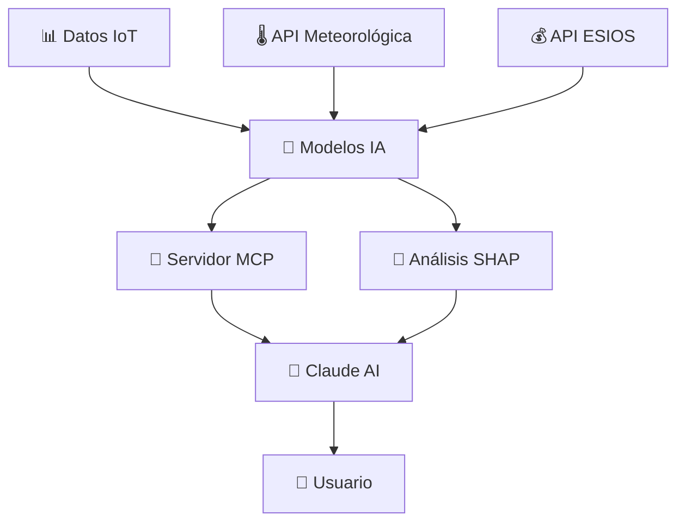

David González Labrada
TFM - Sistema de Predicción Energética con IA
Descripción
TFM sobre la creación de un sistema de predicción energética con un servidor MCP para su acceso basado en IA.
Este proyecto implementa un sistema completo de análisis y predicción del consumo energético doméstico utilizando técnicas de machine learning y explicabilidad de modelos (SHAP). El sistema permite realizar predicciones precisas, analizar patrones históricos y generar recomendaciones personalizadas de optimización energética.
Estructura del Proyecto
Este código incluye todas las funciones utilizadas para la creación, subida y prueba de modelos en la clase modelos_v3. El código del servidor MCP aparece en server.py.
Archivos Principales

modelos_v3.py - Clase principal con funciones para creación, entrenamiento y evaluación de modelos
server.py - Servidor MCP que expone las funcionalidades del sistema
data/ - Datasets de entrenamiento y validación
models/ - Modelos entrenados guardados
shap/outputs - Valores SHAP por modelo y horizonte

Características

Predicción energética utilizando modelos ensemble optimizados
Análisis histórico con breakdown por electrodomésticos
Explicabilidad de modelos mediante valores SHAP
Integración con APIs de precios eléctricos (ESIOS)
Servidor MCP para acceso conversacional via IA
Visualizaciones interactivas de consumo y predicciones
Recomendaciones personalizadas de optimización

Tecnologías Utilizadas

Python 3.8+
Scikit-learn - Modelos de machine learning
XGBoost/LightGBM - Algoritmos ensemble
SHAP - Explicabilidad de modelos
FastAPI - Framework para servidor MCP
Pandas/NumPy - Manipulación de datos

Para conectar con el MCP, se requiere tener un token de acceso a la API de ESIOS y escribir la siguiente configuración en el archivo config del LLM a utilizar que permita la conexión con MCPs mediante STDIO:
{
  "mcpServers": {
       "mcp-david-TFM": {
            "command": "uv",
            "args": [
                "--directory",
                "RUTA DEL PROYECTO",
                "run",
                "-m",
                "davidElectric"
            ],
            "env": {
                "ESIOS_API_TOKEN": "XXXXXXXXXXXXXXXXXXXXXXXXXXXXXXXXXXXXX"
            }
        }
  }
}


# ⚡ Sistema de Predicción Energética con IA

<div align="center">


*TFM sobre la creación de un sistema de predicción energética con un servidor MCP para su acceso basado en IA*

</div>

---

## 🎯 Descripción

Este proyecto implementa un **sistema completo de análisis y predicción del consumo energético doméstico** utilizando técnicas de machine learning y explicabilidad de modelos (SHAP). El sistema permite realizar predicciones precisas, analizar patrones históricos y generar recomendaciones personalizadas de optimización energética a través de una interfaz conversacional con IA.

### ✨ Características Principales

- 🔮 **Predicción energética** utilizando modelos ensemble optimizados
- 📊 **Análisis histórico** con breakdown por electrodomésticos  
- 🧠 **Explicabilidad de modelos** mediante valores SHAP
- 💰 **Integración con APIs** de precios eléctricos (ESIOS)
- 🤖 **Servidor MCP** para acceso conversacional via Claude AI
- 📈 **Visualizaciones interactivas** de consumo y predicciones
- 💡 **Recomendaciones personalizadas** de optimización energética

---

## 📁 Estructura del Proyecto

```
📦 tfm-prediccion-energetica/
├── 🧠 modelos_v3.py          # Clase principal de modelos ML
├── 🚀 server.py              # Servidor MCP 
├── ⚙️ requirements.txt       # Dependencias
├── 🔧 .env.example          # Plantilla de configuración
├── 📂 config/               # Archivos de configuración
├── 📂 data/                 # Datasets y datos de entrenamiento
├── 📂 models/               # Modelos entrenados guardados
└── 📄 README.md             # Este archivo
```

### 🔧 Archivos Principales

- **`modelos_v3.py`** - Clase principal con todas las funciones para creación, entrenamiento y evaluación de modelos
- **`server.py`** - Servidor MCP que expone las funcionalidades del sistema para integración con Claude AI
- **`.env`** - Variables de entorno necesarias para conexión con APIs externas

---

## 🛠️ Tecnologías Utilizadas

<div align="center">

| Categoría | Tecnologías |
|-----------|-------------|
| **🤖 Machine Learning** | Scikit-learn, XGBoost, LightGBM |
| **🧠 Explicabilidad** | SHAP (SHapley Additive exPlanations) |
| **🌐 Backend** | FastAPI, Python 3.8+ |
| **📊 Datos** | Pandas, NumPy, APIs ESIOS |
| **📈 Visualización** | Chart.js, HTML5, CSS3 |
| **🔗 Integración** | MCP (Model Context Protocol) |

</div>

---

## 🚀 Instalación y Configuración

### 📋 Requisitos Previos

- Python 3.8 o superior
- Cuenta en ESIOS (Red Eléctrica de España)
- Acceso a Claude AI con soporte MCP

### 1️⃣ Clonar el Repositorio

```bash
git clone [url-del-repositorio]
cd tfm-prediccion-energetica
```

### 2️⃣ Instalar Dependencias

```bash
pip install -r requirements.txt
```

### 3️⃣ Configurar Variables de Entorno

Crea un archivo `.env` en la raíz del proyecto con la siguiente configuración:

```env
# 🔑 API de ESIOS (Red Eléctrica de España)
# Obtener en: https://www.esios.ree.es/es/pagina/api
ESIOS_TOKEN=your_esios_api_token_here

# 🌐 Configuración del Servidor MCP
MCP_HOST=localhost
MCP_PORT=8000
DEBUG_MODE=True

# 📊 Configuración de Modelos
MODEL_PATH=./models/
DATA_PATH=./data/
CACHE_ENABLED=True

# 🔒 Configuración de Seguridad
SECRET_KEY=your_secret_key_here
API_RATE_LIMIT=100
```

### 4️⃣ Configuración de ESIOS API

Para conectar con la API de ESIOS necesitas:

1. **Registrarte** en [ESIOS](https://www.esios.ree.es/es/pagina/api)
2. **Obtener tu token** de API personal
3. **Configurar los indicadores** que utilizamos:
   - `1001` - PVPC (Precio Voluntario Pequeño Consumidor)
   - `600` - Precio del mercado OMIE
   - `10209` - Previsiones de precio
   - `805` - Precio marginal del sistema

```python
# Configuración en el código (ya incluida)
ESIOS_INDICATORS = {
    "actual": 1001,      # PVPC - Precios reales
    "market": 600,       # OMIE - Precios de mercado  
    "forecast": 10209,   # Previsiones
    "marginal": 805      # Precio marginal
}
```

---

## ▶️ Uso del Sistema

### 🎓 Entrenar Modelos

```bash
# Entrenar todos los modelos
python modelos_v3.py --train

# Entrenar modelo específico
python modelos_v3.py --train --appliance "Fridge"

# Validación cruzada
python modelos_v3.py --validate
```

### 🚀 Iniciar Servidor MCP

```bash
# Modo producción
python server.py

# Modo desarrollo con debug
python server.py --debug

# Puerto personalizado
python server.py --port 8080
```

### 🤖 Funciones Disponibles via MCP

| Función | Descripción | Parámetros |
|---------|-------------|------------|
| `predict_consumption()` | Predicciones de consumo futuro | `init_date`, `end_date` |
| `get_consumption_analysis()` | Análisis histórico detallado | `init_date`, `end_date` |
| `explain_predictions()` | Explicabilidad con SHAP | `appliance`, `horizon` |
| `get_precio()` | Consulta precios eléctricos | `init_date`, `end_date`, `price_type` |
| `get_precio_inteligente()` | Precio con fallback automático | `target_date` |

---

## 📊 Resultados y Métricas

<div align="center">

### 🎯 Precisión de Modelos

| Métrica | Electrodomésticos Continuos | Electrodomésticos Intermitentes |
|---------|---------------------------|--------------------------------|
| **MAE** | < 0.3 kWh/día | < 0.5 kWh/día |
| **MAPE** | < 10% | < 15% |
| **R²** | > 0.90 | > 0.75 |

### 🧠 Explicabilidad

- **Factores identificados**: Temperatura, historial, estacionalidad, día de la semana
- **Variabilidad explicada**: >90% para modelos simples, >75% para complejos
- **Transparencia**: 100% de decisiones explicables via SHAP

</div>

---

## 🏗️ Arquitectura del Sistema



---

## 💡 Ejemplos de Uso

### Predicción de Consumo

```python
# Predecir consumo para la próxima semana
predictions = predict_consumption(
    init_date="2025-07-01",
    end_date="2025-07-07"
)
```

### Análisis Histórico

```python
# Analizar consumo del mes pasado
analysis = get_consumption_analysis(
    init_date="2025-06-01", 
    end_date="2025-06-30"
)
```

### Explicabilidad

```python
# Explicar predicciones del frigorífico
explanation = explain_predictions(
    appliance="Fridge",
    horizon="7"
)
```

---

## 🔒 Licencia y Términos Legales

### ⚖️ AVISO LEGAL IMPORTANTE

> **Cualquier distribución ilegal del contenido de este repositorio privado será perseguida legalmente hasta las últimas consecuencias.**

Este material está protegido por **derechos de autor** y constituye **propiedad intelectual** del autor. Su uso está limitado exclusivamente a:

✅ **Permitido:**
- Evaluación académica por el tribunal del TFM
- Consulta de referencia con autorización previa  
- Fines educativos no comerciales (con cita obligatoria)

❌ **Prohibido:**
- Uso comercial sin licencia
- Redistribución sin autorización
- Plagio o apropiación indebida
- Modificación de autoría

Para solicitar permisos de uso, contactar al autor.

